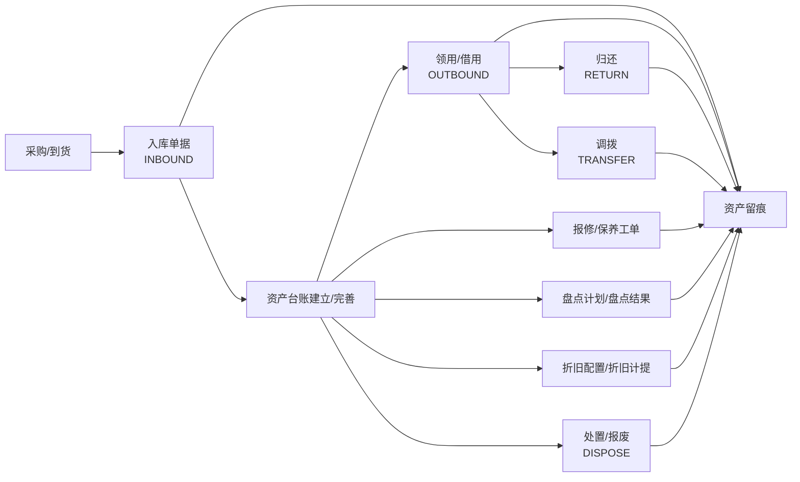

# 资产管理系统使用说明书（AM 模块）

本说明书面向“普通业务用户”，用于解释资产管理系统各模块的用途、字段含义、模块关系与常见流程。

> 说明：系统菜单可能由后台配置决定；本文按前端页面目录 `admin/src/views/am/*` 与后端实体含义进行说明。

## 1. 快速开始（建议顺序）

1. 基础资料：供应商、仓库、库位、地点、资产分类（字典）
2. 资产台账：录入或维护资产的主数据（编号、名称、分类、位置、责任人等）
3. 单据管理：记录资产的业务流转（入库/领用/借用/归还/调拨/变更/处置/盘盈盘亏）
4. 盘点计划：按范围生成盘点任务，记录盘点结果
5. 维修/保养：报修/保养工单 & 保养计划
6. 折旧：折旧配置（每个资产）→ 折旧计提（按月生成批次与明细）
7. 提醒：提醒规则（定义提醒逻辑）→ 提醒任务（具体推送/待办）
8. 资产留痕：查看资产“溯源/留痕”时间线（谁在什么时候做了什么）

## 2. 模块导航（按目录）

- 资产台账：`modules/asset-ledger.md`
- 单据管理：`modules/doc-management.md`
- 资产留痕（溯源）：`modules/asset-history.md`
- 盘点计划：`modules/inventory-plan.md`
- 维修/保养工单：`modules/maintenance-order.md`
- 保养计划：`modules/maintenance-plan.md`
- 折旧配置：`modules/depreciation-config.md`
- 折旧计提：`modules/depreciation-run.md`
- 提醒规则：`modules/reminder-rule.md`
- 提醒任务：`modules/reminder-task.md`
- 基础资料：`modules/master-data.md`
- 分类扩展/自定义字段（进阶）：`modules/category-extension.md`

## 2.1 流程图索引

- 资产生命周期：`flows/asset-lifecycle.md`
- 单据常见流转：`flows/doc-flows.md`
- 数据关系图（ER）：`flows/data-model-er.md`

## 2.2 术语表

- 术语表：`01-glossary.md`

## 3. 核心概念与关系（你只要记住这几件事）

- **资产台账**：资产的“身份证”（主数据）。所有业务最终都围绕资产展开。
- **单据**：资产发生“业务动作”的凭证（入库、领用、调拨、处置等），用于流程管理与追溯。
- **盘点**：核对“系统记录”和“现场实际”的差异，并记录结果。
- **维修/保养**：记录资产故障与维护过程，沉淀成本与履历。
- **折旧**：对资产价值的会计处理（配置每个资产怎么折旧；每月计提一次）。
- **提醒**：把“到期/应该做的事”提前推给相关人（如质保到期、借用到期、盘点到期等）。
- **资产留痕（溯源）**：把关键操作以时间线记录下来，便于审计与定位问题。

## 4. 模块关系图（总览）

```mermaid
flowchart TB
  subgraph 基础资料
    C[资产分类\n(字典)]
    V[供应商]
    W[仓库]
    B[库位]
    L[地点]
    U[用户/组织]
  end

  A[资产台账\nam_asset]
  D[单据管理\nam_doc + am_doc_item]
  I[盘点计划\nam_inventory_plan + am_inventory_item]
  MO[维修/保养工单\nam_maintenance_order]
  MP[保养计划\nam_maintenance_plan]
  DC[折旧配置\nam_asset_depreciation]
  DR[折旧计提\nam_depreciation_run + items]
  RR[提醒规则\nam_reminder_rule]
  RT[提醒任务\nam_reminder_task]
  H[资产留痕/溯源\nam_asset_history]

  C --> A
  V --> A
  W --> A
  B --> A
  L --> A
  U --> A

  A --> D
  A --> I
  A --> MO
  A --> MP
  A --> DC

  DC --> DR
  RR --> RT

  D --> H
  I --> H
  MO --> H
  A --> H
```

## 5. 典型业务流程图（从“买到→用→修→盘→报废”）



## 6. 常见角色分工（建议）

- 资产管理员：维护基础资料、资产台账、审批/归档单据，处理盘点与处置。
- 使用部门/员工：发起领用/借用/归还申请，发起报修。
- 维修负责人/工程师：处理工单、登记费用与结果。
- 财务：配置折旧规则，执行每月折旧计提，导出报表。
- 管理层/审计：查看资产留痕、盘点差异、维修成本、折旧汇总。

## 7. 导出报表

系统部分模块提供 **导出 Excel**（以当前筛选条件导出）：

- 资产台账：资产列表页
- 单据管理：单据列表页
- 资产留痕：留痕列表页

## 8. 目录结构建议（你要写/补文档时）

- `flows/`：流程图与端到端说明
- `modules/`：每个模块的字段与操作说明
