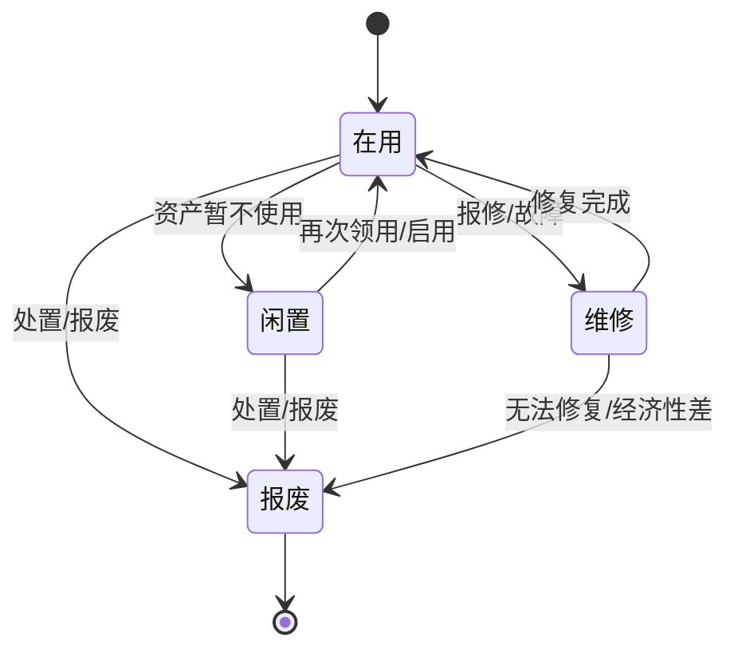

# 流程图：资产生命周期（建议口径）

资产生命周期指资产从“建档/入库”到“使用/维护/盘点/处置”的全过程。不同公司会有不同制度，下面给出一套通用且易落地的口径。

## 1) 状态机（台账 Status）

## 2) 建议的“凭证链”（可审计）

为了让“资产留痕/溯源”更完整，建议把关键动作尽量落在“单据/工单/盘点”上：

- 入库：INBOUND 单据（或初始化导入）→ 资产台账建立
- 领用/借用：OUTBOUND 单据（子类型 ISSUE/BORROW）
- 归还：RETURN 单据
- 调拨：TRANSFER 单据
- 信息变更：CHANGE 单据（或有变更审批时）
- 维修/保养：工单
- 盘点：盘点计划 + 盘点结果
- 处置/报废：DISPOSE 单据

> 这样做的好处：以后出现差异，可以按单据/工单回溯到“谁、何时、基于什么原因”做了变更。

