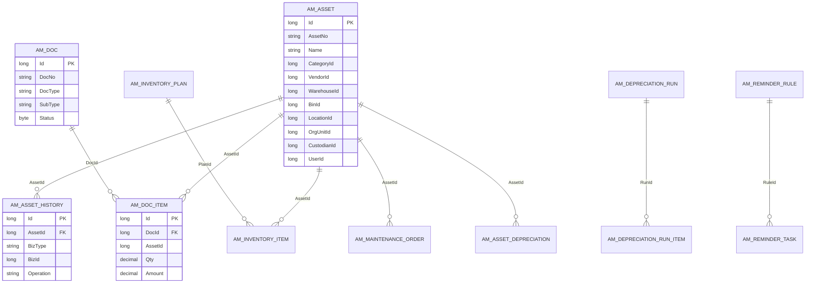

# 数据关系图（ER，帮助理解“关联字段”）

该图用于帮助业务人员理解：为什么很多地方要填“资产Id / 单据Id / 工单Id”等，以及这些 Id 之间如何关联。

阅读建议：
- 如果你在留痕里看到 BizType=MAINTENANCE、BizId=xxx，通常表示这条留痕关联到“某个工单Id=xxx”。
- 如果你在提醒任务里看到 BizType=DOC、BizId=xxx，通常表示这条提醒关联到“某张单据Id=xxx”。

