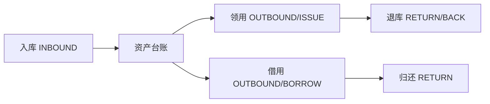
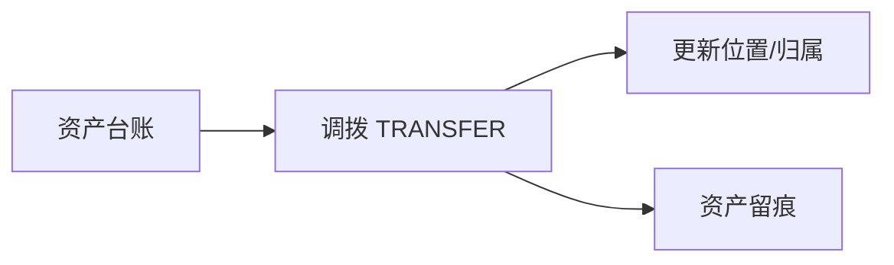
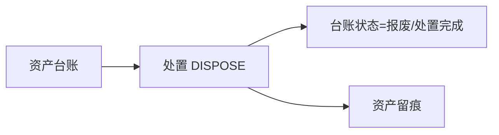

# 流程图：单据类型与典型流转

本页用流程图帮助你理解“单据类型”和“资产台账”的关系。

## 1) 出入库/借用归还（最常用）

要点：
- “借用”通常有到期时间（DueTime），便于做提醒（BORROW_DUE）。
- “领用”更偏长期占用，是否需要归还由制度决定。

## 2) 调拨（仓库/地点/部门/人员变更）

建议记录的信息：
- 来源/目标仓库、地点、部门、责任人、使用人
- 是否需要“签收截止”（DueTime）与“签收提醒”（TRANSFER_SIGN）

## 3) 处置/报废

建议把处置原因写到备注中（例如：报废原因、出售去向、丢失说明）。

