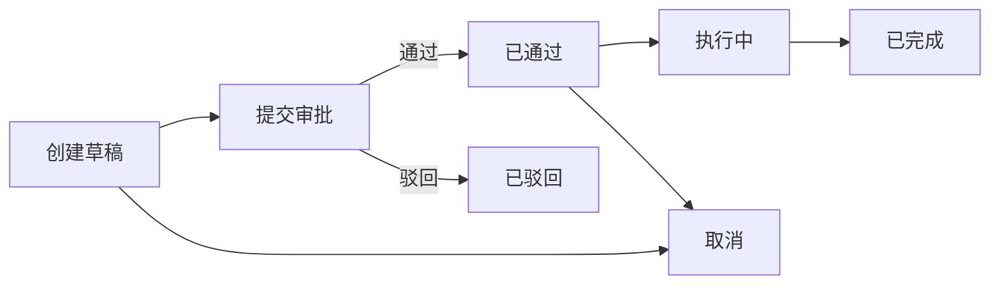

# 单据管理（资产业务单据）

单据用于记录资产发生的“业务动作”，并承载审批/执行/追溯信息。常见的业务动作包括：入库、领用/借用、归还、调拨、变更、处置、盘盈盘亏（库存调整）。

> 提示：是否会“自动联动”资产台账（例如执行后自动更新资产地点/责任人/状态），取决于你们系统的业务规则与后端实现。即使不自动联动，单据仍然是非常重要的凭证与审计来源。

## 1) 单据类型（DocType）

| DocType | 含义 | 常见场景 |
|---|---|---|
| INBOUND | 入库 | 采购入库、归还入库、初始化入库 |
| OUTBOUND | 出库/领用 | 领用、借用 |
| RETURN | 归还 | 借用归还、领用退库 |
| TRANSFER | 调拨 | 仓库/地点/部门之间转移 |
| CHANGE | 变更 | 资产信息变更（责任人/使用人/地点等） |
| DISPOSE | 处置 | 报废、出售、丢失（资产退出使用） |
| INV_ADJUST | 盘盈盘亏 | 盘点差异调整（盘盈/盘亏） |

子类型（SubType）用于更细分的场景，例如：
- OUTBOUND：ISSUE（领用）、BORROW（借用）
- RETURN：RETURN（归还）、BACK（退库）
- DISPOSE：SCRAP（报废）、SELL（出售）、LOSS（丢失）

说明：
- INV_ADJUST 是“盘点结果的调整单据”，不等同于“盘点计划/盘点执行（INVENTORY）”模块。
- DISPOSE 表示资产处置动作（报废/出售/丢失等），通常发生在处置审批完成并执行后。

## 2) 单据状态（Status）

| 状态值 | 名称 | 说明 |
|---:|---|---|
| 0 | 草稿 | 可编辑 |
| 1 | 待审批 | 等待审批/审核 |
| 2 | 已通过 | 审批通过 |
| 3 | 已驳回 | 审批拒绝 |
| 4 | 执行中 | 已进入执行流程 |
| 5 | 已完成 | 执行完成（业务生效） |
| 6 | 已取消 | 作废 |

## 3) 单据字段说明（常用）

| 字段 | 含义 |
|---|---|
| 单据号（DocNo） | 单据唯一编号 |
| 单据类型/子类型（DocType/SubType） | 业务动作类型 |
| 发起人/发起时间（ApplyUserId/ApplyTime） | 谁发起、何时发起 |
| 审批人/审批时间（ApproveUserId/ApproveTime） | 谁审批、何时审批 |
| 关联工作流（WfInstanceId） | 若系统启用工作流 |
| 关联单据（RefDocId） | 如“归还关联借用单” |
| 供应商（VendorId） | 入库/维修相关 |
| 来源/目标仓库（FromWarehouseId/ToWarehouseId） | 调拨/出入库 |
| 来源/目标地点（FromLocationId/ToLocationId） | 调拨/变更 |
| 来源/目标部门（FromOrgUnitId/ToOrgUnitId） | 调拨/变更 |
| 来源/目标责任人（FromCustodianId/ToCustodianId） | 调拨/变更 |
| 来源/目标使用人（FromUserId/ToUserId） | 调拨/变更 |
| 业务时间（BizTime） | 发生时间（不是创建时间） |
| 到期时间（DueTime） | 借用归还截止/调拨签收截止等 |
| 金额合计（TotalAmount） | 明细金额汇总 |
| 备注（Remark） | 说明 |

## 4) 单据明细（Items）

每张单据通常包含多行明细，每行明细对应一件（或一类）资产：

常见字段：
- 资产Id/资产编号/资产名称（可冗余）
- 数量、单价、金额
- 行级仓库/库位/地点（行级覆盖头部的目标值）
- 质保到期日（WarrantyExpireDate，入库单可选）
- 备注

> 经验：即使“头部”有来源/目标，明细里仍建议带上行级字段，以便做精细控制与审计。

## 5) 推荐使用流程（简版）

## 6) 与其它模块的关系

- 资产台账：单据引用资产，单据完成后通常会导致资产位置/归属/状态变化（具体看系统是否联动）
- 资产留痕：单据的 CREATE/UPDATE/DELETE 等操作可写入留痕；若你们把“执行”也纳入留痕，建议记录 Operation=STATUS/LOCATION/OWNER 等
- 提醒：借用到期、调拨签收等可通过单据 DueTime 产生提醒任务
- 入库联动：当 DocType=INBOUND 且状态为“已完成”，系统会同步资产入库时间（InboundTime=BizTime），并可根据明细中的质保到期日同步资产的 WarrantyExpireDate
