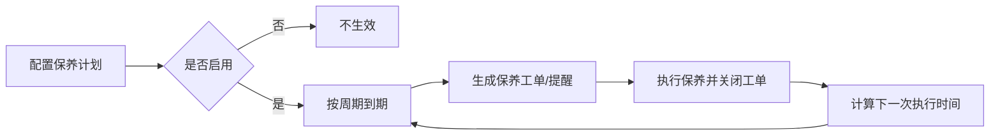

# 保养计划（预防性维护）

保养计划用于“按周期自动生成保养工单/提醒”，让资产按制度定期维护，降低故障率。

## 1) 主要字段说明

| 字段 | 含义 |
|---|---|
| 计划编号（PlanNo） | 计划编号 |
| 计划名称（Name） | 计划名称 |
| 周期类型（CycleType） | DAY/WEEK/MONTH/YEAR |
| 周期值（CycleValue） | 每多少天/周/月/年一次 |
| 下次执行时间（NextRunTime） | 下次生成工单/执行时间 |
| 启用状态（IsEnabled） | 是否启用 |
| 适用范围（ScopeJson） | 适用哪些资产（分类/地点/资产列表等） |
| 备注（Remark） | 说明 |

## 2) ScopeJson（适用范围）怎么理解

ScopeJson 的目的：用一个“可配置的范围描述”来表达“这条保养计划覆盖哪些资产”。

常见范围表达方式（举例）：
- 按分类：覆盖某几类资产（如：空调设备）
- 按地点：覆盖某个园区/楼栋/楼层的资产
- 按资产清单：点选具体资产
- 组合：分类 + 地点共同约束

## 3) 推荐流程

## 4) 与其它模块的关系

- 维修/保养工单：计划到期后通常会生成“保养工单”
- 提醒规则/任务：计划到期可生成提醒任务
- 资产台账：范围最终映射到资产
- 资产留痕：计划本身的变更与生成工单过程可写入留痕（若你们纳入审计）

