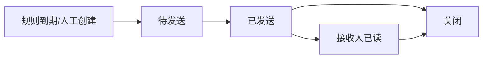

# 提醒任务（具体的提醒待办）

提醒任务是“提醒规则”生成的具体待办/推送记录，也可以手动创建。

## 1) 核心字段说明

| 字段 | 含义 |
|---|---|
| 规则Id（RuleId） | 来自哪条提醒规则 |
| 业务类型（BizType） | ASSET/DOC/INVENTORY/MAINTENANCE 等 |
| 业务Id（BizId） | 对应业务对象的主键（如资产Id、单据Id、盘点计划Id、工单Id） |
| 接收人（ReceiverUserId） | 谁来接收这条提醒 |
| 标题/内容（Title/Content） | 提醒内容 |
| 到期/触发时间（DueTime） | 什么时候触发 |
| 状态（Status） | 0待发送/1已发送/2已读/3已关闭 |

## 2) 推荐流程

## 3) 业务Id（BizId）到底是什么？

BizId 不是“任务自己的 Id”，而是“被提醒的业务对象”的主键：

- BizType=ASSET：BizId=资产Id
- BizType=DOC：BizId=单据Id
- BizType=INVENTORY：BizId=盘点计划Id（或盘点单Id）
- BizType=MAINTENANCE：BizId=维修/保养工单Id

## 4) 与其它模块的关系

- 规则（ReminderRule）：决定“提醒什么、提前多久、给谁”
- 业务对象：资产/单据/盘点/维修等提供到期字段与业务上下文

